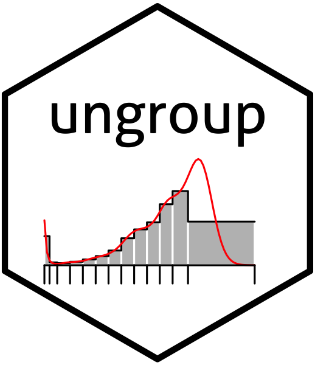

#  Penalized Composite Link Model for Efficient Estimation of Smooth Distributions from Coarsely Binned Data 
[](https://cran.r-project.org/package=ungroup)
[](https://app.codecov.io/github/mpascariu/ungroup)
[](https://github.com/mpascariu/ungroup/issues)
[](https://doi.org/10.21105/joss.00937)

[](https://lifecycle.r-lib.org/articles/stages.html)
[](https://github.com/mpascariu/ungroup/blob/master/LICENSE)
[](https://CRAN.R-project.org/package=ungroup)
[](https://CRAN.R-project.org/package=ungroup)

This repository contains a versatile method for ungrouping histograms (binned count data) assuming that counts are Poisson distributed and that the underlying sequence on a fine grid to be estimated is smooth. The method is based on the composite link model and estimation is achieved by maximizing a penalized likelihood. Smooth detailed sequences of counts and rates are so estimated from the binned counts. Ungrouping binned data can be desirable for many reasons: Bins can be too coarse to allow for accurate analysis; comparisons can be hindered when different grouping approaches are used in different histograms; and the last interval is often wide and open-ended and, thus, covers a lot of information in the tail area. Age-at-death distributions grouped in age classes and abridged life tables are examples of binned data. Because of modest assumptions, the approach is suitable for many demographic and epidemiological applications. For a detailed description of the method and applications see Rizzi et al. (2015).

## Installation

1. Make sure you have the most recent version of R
2. Run the following code in your R console 

   ```R
   install.packages("ungroup")
   ```

## Updating to the latest version of `ungroup` package

You can track (and contribute to) the development of `ungroup` at https://github.com/mpascariu/ungroup. To install it:

1. Install the release version of `devtools` from CRAN with `install.packages("devtools")`.

2. Make sure you have a working development environment.
    * **Windows**: Install [Rtools](https://CRAN.R-project.org/bin/windows/Rtools/).
    * **Mac**: Install `Xcode` from the Mac App Store.
    * **Linux**: Install a compiler and various development libraries (details vary across different flavours of Linux).

3. Install the development version of `ungroup`.

   ```R
   devtools::install_github("mpascariu/ungroup")
   ```

## Intro
Get started with `ungroup` by checking the vignette
 ```R
 browseVignettes(package = "ungroup") 
 ```

## Contributing
This software is an academic project. We welcome any issues and pull requests.
* If `ungroup` is malfunctioning, please report the case by submitting an issue on GitHub.
* If you wish to contribute, please submit a pull request following the guidelines in [CONTRIBUTING.md](https://github.com/mpascariu/ungroup/blob/master/CONTRIBUTING.md).


## References
Rizzi S, Gampe J and Eilers PHC. 2015. [Efficient Estimation of Smooth Distributions From Coarsely Grouped Data.](https://doi.org/10.1093/aje/kwv020) American Journal of Epidemiology, Volume 182, Issue 2, Pages 138-147.

Eilers PHC. 2007. [Ill-posed problems with counts, the composite link model and penalized likelihood.](https://doi.org/10.1177/1471082X0700700302) Statistical Modelling, Volume 7, Issue 3, Pages 239-254.

