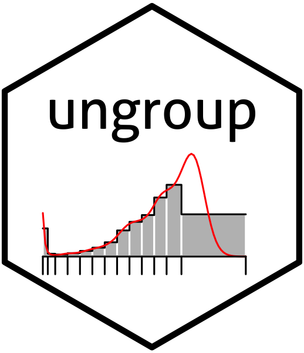

# ungroup: estimating smooth distributions from coarsely binned data

<!-- badges: start -->
[](https://CRAN.R-project.org/package=ungroup)
[](https://github.com/mpascariu/ungroup/actions/workflows/R-CMD-check.yaml)
[](https://mpascariu.github.io/ungroup/)
[](https://doi.org/10.21105/joss.00937)
[](https://github.com/mpascariu/ungroup/blob/master/LICENSE)
[](https://CRAN.R-project.org/package=ungroup)
<!-- badges: end -->

`ungroup` recovers a smooth, fine-grained distribution from counts that were
published in coarse bins. It implements the penalized composite link model:
the coarse counts are treated as indirect observations of a smooth underlying
sequence, and that sequence is estimated by penalized maximum likelihood.

This is the problem it solves. Deaths come in five-year age groups with a wide
open interval at the top, and you need single years of age. Spreading each
bin's count evenly over its width gives a step function no smoother than the
input, and it is biased: in the Swedish male data shipped with the package,
that naive approach overstates life expectancy at birth by an average of 2.5
years. `ungroup` recovers the same sequence to within a tenth of a year, and
it keeps the total mass fixed, redistributing exactly the deaths it was given.

```r
library(ungroup)

# Deaths in [0,1), [1,5), [5,10), ..., [85,111).
x <- c(0, 1, seq(5, 85, by = 5))
y <- c(294, 66, 32, 44, 170, 284, 287, 293, 361, 600, 998,
       1572, 2529, 4637, 6161, 7369, 10481, 15293, 39016)
nlast <- 26

M <- pclm(x = x, y = y, nlast = nlast)

# The print method gives the shape of the fit.
M
#> Penalized Composite Link Model (PCLM)
#> PCLM Type               : Univariate
#> Number of input groups  : 19
#> Number of fitted values : 111
#> Length of estimate bins : 1

# summary() adds the smoothing parameters and the information criteria.
summary(M)
#> Smoothing parameter lambda   : 0.1
#> B-splines intervals/knot (kr): 2
#> B-splines degree (deg)       : 3
#> AIC                          : 39.97
#> BIC                          : 59.81

head(fitted(M), 3)
#>     [0,1)      [1,2)      [2,3)
#> 292.254945  47.567040  12.031104

sum(fitted(M)) == sum(y)   # mass is conserved
#> [1] TRUE

plot(M, xlab = "Age, x", ylab = "Deaths")
```

## What it does

| capability | how |
|---|---|
| Ungroup counts into a finer grid | `pclm(x, y, nlast)`, any `out.step` from 0.1 to 1 |
| Ungroup a surface over time | `pclm2D(x, y, nlast)` for a matrix of years by age |
| Estimate rates instead of counts | pass an `offset` of exposures |
| Say where the distribution closes | `omega = 111` instead of `nlast = 26` |
| Smooth over unobserved cells | `na.action = "omit"` |
| Accuracy, not just appearance | the fit re-aggregates to the input counts, exactly |
| Intervals | pointwise `ci$conf_lower`/`conf_upper`, and mass-preserving `ci$lower`/`upper` |

## Installation

```r
install.packages("ungroup")
```

Development version, from GitHub:

```r
# install.packages("devtools")
devtools::install_github("mpascariu/ungroup")
```

## Documentation

- **Tutorial:** <https://mpascariu.github.io/ungroup/articles/Intro.html> walks
  through the model, the smoothing parameter, missing data, the two kinds of
  interval the output carries, and how to read all of it.
- **Reference:** <https://mpascariu.github.io/ungroup/reference/index.html>.
- Locally: `vignette("Intro", package = "ungroup")`.

## Four things worth knowing before you trust the output

1. **`nlast` is an assumption, not an input.** The count in the open interval
   does not say how wide it is. Get it wrong and the whole tail is wrong.
2. **`ci$lower` and `ci$upper` are scenarios, not bounds.** They are
   mass-preserving and they cross the fitted curve in the tail. Use
   `ci$conf_lower` and `ci$conf_upper` for a pointwise error bar.
3. **`out.step` is interpolation.** A finer output grid does not create
   information the input bins never held.
4. **`na.action = "omit"` fills gaps with estimates.** That is the point of
   it, but the fitted total then exceeds the observed total by the mass the
   model places in the unobserved cells.

## Method

The model is the penalized composite link model of Eilers (2007), built on the
composite link model of Thompson and Baker (1981). The one-dimensional
estimator follows Rizzi, Gampe and Eilers (2015); the two-dimensional
extension with smoothing across adjacent years follows Rizzi et al. (2019).
Smoothing parameters are selected by BIC or AIC.

## Citation

```r
citation("ungroup")
```

Pascariu, M. D., Dańko, M. J., Schöley, J., and Rizzi, S. (2018). ungroup: An
R package for efficient estimation of smooth distributions from coarsely
binned data. *Journal of Open Source Software*, 3(29), 937.
<https://doi.org/10.21105/joss.00937>

## Contributing

Issues and pull requests are welcome. If `ungroup` misbehaves, please open an
issue with a minimal reproducible example. See
[CONTRIBUTING.md](https://github.com/mpascariu/ungroup/blob/master/CONTRIBUTING.md).
This project is released with a
[Contributor Code of Conduct](https://github.com/mpascariu/ungroup/blob/master/CODE_OF_CONDUCT.md).

## References

Eilers, P. H. C. (2007). Ill-posed problems with counts, the composite link
model and penalized likelihood. *Statistical Modelling*, 7(3), 239-254.
<https://doi.org/10.1177/1471082X0700700302>

Rizzi, S., Gampe, J., and Eilers, P. H. C. (2015). Efficient estimation of
smooth distributions from coarsely grouped data. *American Journal of
Epidemiology*, 182(2), 138-147. <https://doi.org/10.1093/aje/kwv020>

Rizzi, S., Halekoh, U., Thinggaard, M., Engholm, G., Christensen, N.,
Johannesen, T. B., and Lindahl-Jacobsen, R. (2019). How to estimate mortality
trends from grouped vital statistics. *International Journal of
Epidemiology*, 48(2), 571-582. <https://doi.org/10.1093/ije/dyy183>

Thompson, R. and Baker, R. J. (1981). Composite link functions in generalized
linear models. *Applied Statistics*, 30(2), 125-131.
